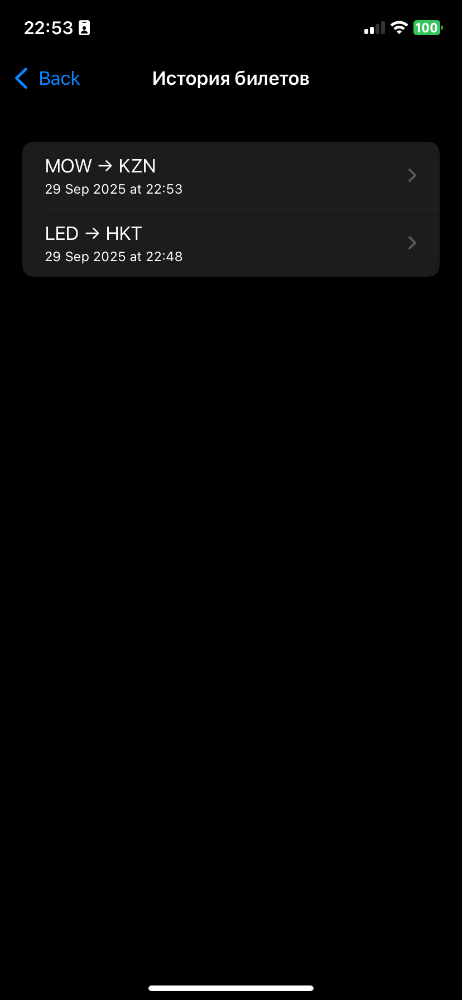

# FlightBooking


**FlightBooking** — учебное iOS-приложение на Swift для поиска авиабилетов и хранения истории QR-сканов билетов.  
Проект сделан на стеке **UIKit + SnapKit + CoreData + GCD**, с кастомной вёрсткой в card-стиле.

---

## Возможности
-  **Список рейсов** — загрузка по API [Travelpayouts](https://travelpayouts.com)  
-  **Фильтры** — выбор направления (откуда/куда), даты, swap-кнопка  
-  **Цветовая индикация** — цена подсвечивается по диапазонам  
-  **Детали рейса** — модальное окно с подробной информацией  
-  **QR-сканер** — считывание билетов и сохранение в CoreData  
-  **История сканов** — просмотр и удаление старых билетов

---

##  Технологии
- **Swift 5**, UIKit, AutoLayout через **SnapKit**
- **CoreData** — для локального хранения сканов
- **GCD** — для фоновой загрузки API и работы с камерой
- **AVFoundation** — для QR-сканирования
- **NSFetchedResultsController** — live-обновления таблицы истории

---

##  Видео

[Смотреть видео](https://youtube.com/shorts/Mz63XlNTW_s?si=LzfCs_HpLCeluK5Z)

---

##  Скриншоты

| Главный экран | Поиск | Детали |
|---------------|-------|--------|
|  |  |  |

| История | Удаление |
|--------|----------|
|  |  |

---

##  Демонстрация сканирования

<p align="center">
  
</p>

---

##  Пример QR-кода для теста

<a href="http://qrcoder.ru" target="_blank">
  
</a>

QR-код содержит JSON следующего вида:

```json
{
  "origin": "MOW",
  "destination": "KZN",
  "price": 180,
  "currency": "USD",
  "departure_at": "2025-11-25T11:00:00Z",
  "return_at": "2025-12-18T10:05:00Z",
  "airline": "SU",
  "flight_number": 6131
}

---
##  Установка
1. Клонируйте проект  
   ```bash
   git clone https://github.com/yourusername/FlightBooking.git
   
   TOKEN -> Token.plist 
   
<dict>
<key>TRAVELPAYOUTS_TOKEN</key>
<string>ВАШ_ТОКЕН</string>
</dict>

